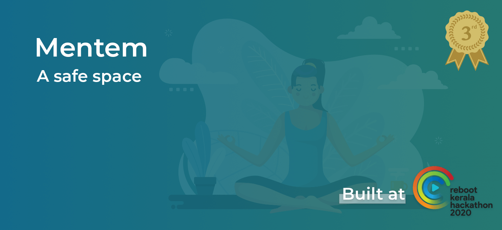

## The Idea
Mental health issues often don't get into the headlies of many discussions regarding public health. However, this is one area where technology could go a long way.

We wanted to implement a system where people could have access to effective, yet discrete mental health support. In a nutshell, we wanted to build a safe space.

### The present situation...
---
We've spent a long time ignoring a multitude of facets of life under the tag of "man up" or dont be a baby, or to quote David rose from Schitt's Creek...

This needs to change.  It's gonna happen only if we start talking about it <b>openly</b>. Take off the stigma around it.

### How did we get here?
---
So we got a chance to take part in a [state wide hackathon](https://reboot.asapkerala.gov.in) and we picked the healthcare track. We wanted to build something that (duh, would win, but also) once deployed, could help make atleast a minor difference in a few people's lives. 

> As they say, Baby steps. Baby steps first.

### What is mentem?
---
Mentem was originally intended to be an all in one platform for health clinics to provide assistance,and for people like you and me to seek medical support. 

---
Here's a quick video showing what is included out of the box.

#### The Patient's side
--- 

<!--  -->

#### The Doctor's side
---

<!--  -->

#### Super condensed description with tech involved 
---
##### What we have is a web app, which for the average user, works like a chatbot presents takes questions from the MS test (a standardized test for measuring mental health). The reports are sent to a medical practitioner. 

##### There's a live chat feature for consultation, which implements a few emotion/sentiment detection models and gives the results to the doctor during the video chat. 

##### We were given exposure to professionals in the field of mental health, and desicions on implementations were taken after consulting with them.
---

Find the slides we used [here](https://speakerdeck.com/nullpointxr/mentem)

#### Graphic Credits
---
Cover Image: [Freepik](https://www.freepik.com/vectors/sport)

Schitt's Creek: [spotern](https://www.spotern.com/en/wanted/tv/schitt-s-creek/49664/black-zipper-sweater-of-david-rose-daniel-levy-in-schitt-s-creek-s01)

